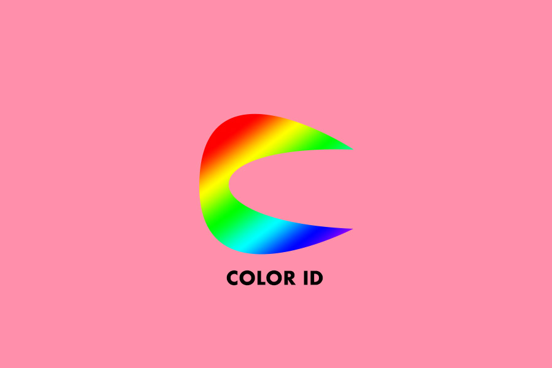

# Color-Identifier
*Have you ever not known a color of an object where knowing the color would certainly be helpful?
Well this is the app for you!*

This app allows those with color-blindness or seeing disabilities to understand how colorful the world is around them.
Color Identifier brings a dull world to life! You can use a picture from your photo library or take one then and there and drag over
an object to identify the specific color. Life has never been brighter!

## Process
I did a lot research, first on how to create a proper camera app, and then to find out how I could using touching to identify the color of a specific pixel in an image.

 
